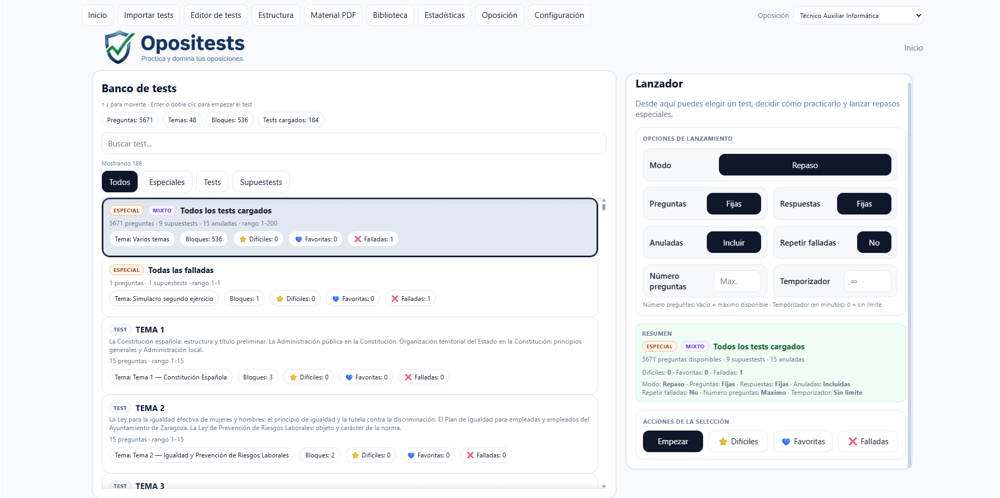
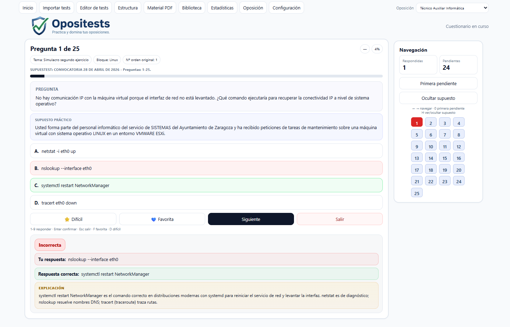
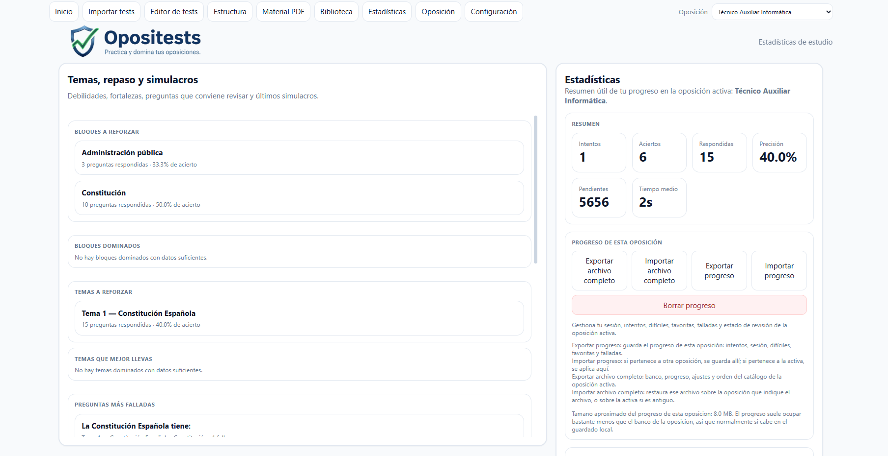
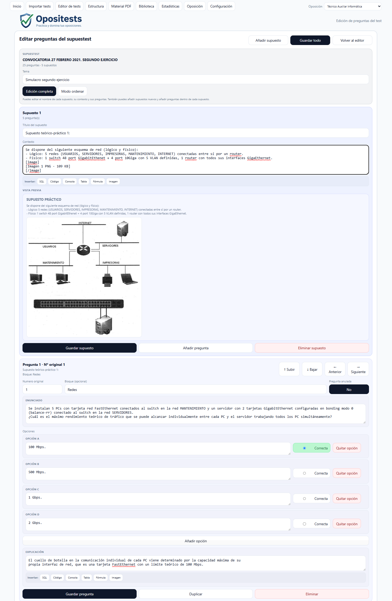
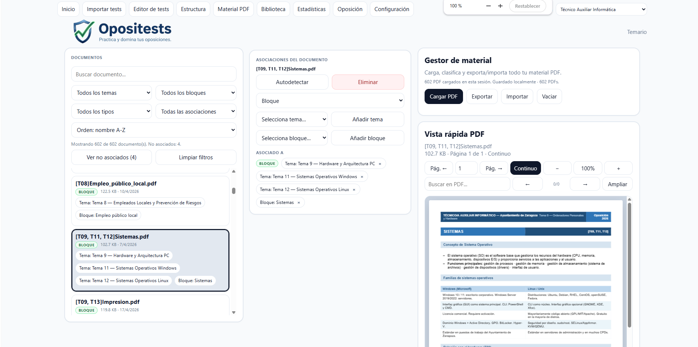
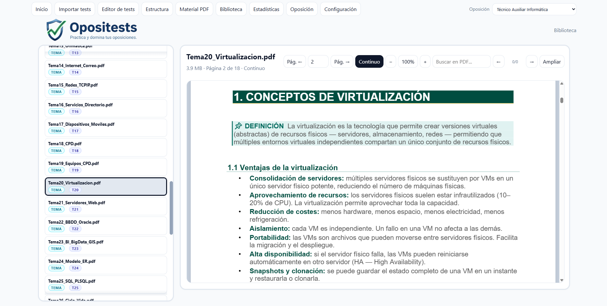
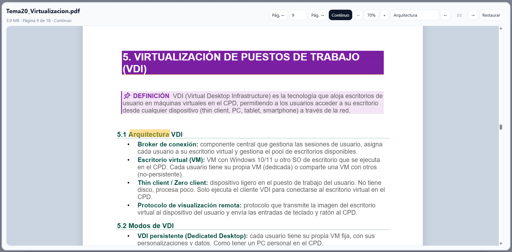
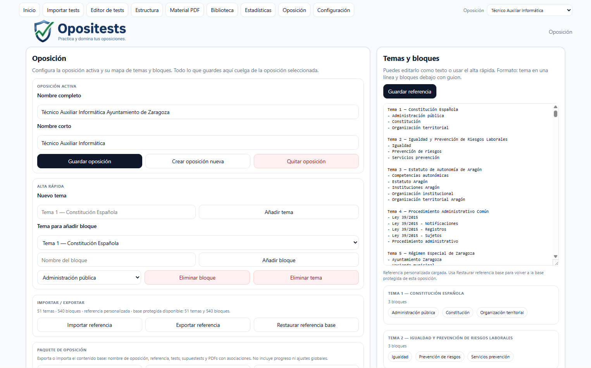
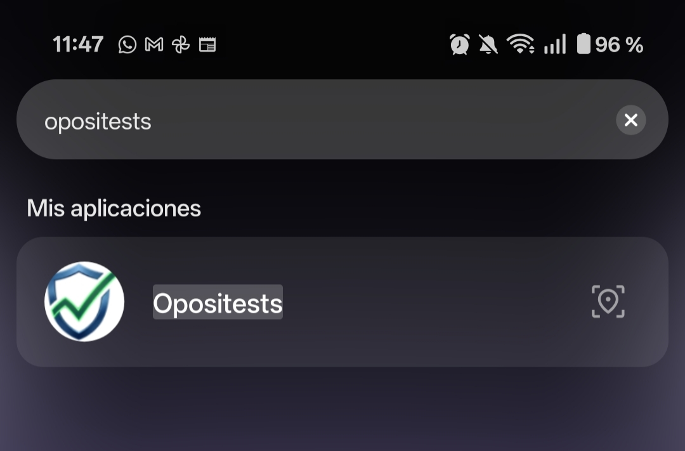
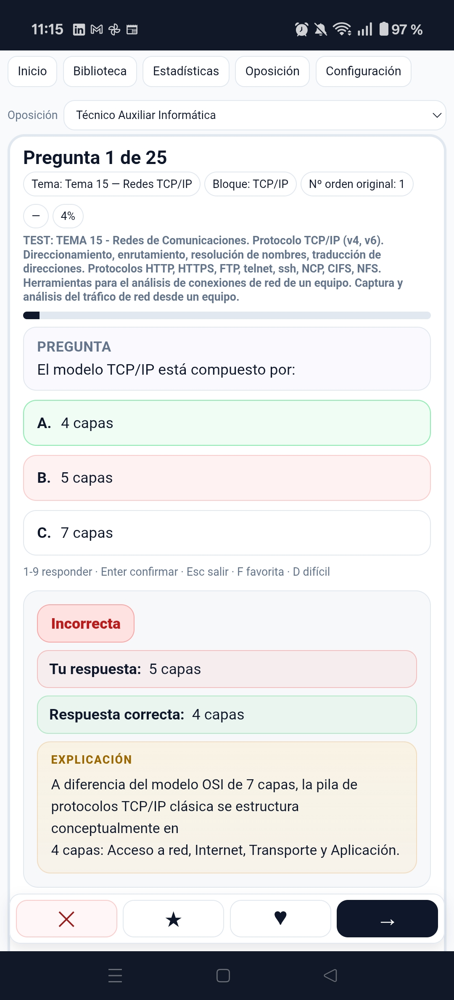

# Opositests

**Aplicación local multiplataforma para la preparación de oposiciones**, con banco de tests, supuestos prácticos, material PDF asociado, estadísticas de progreso y perfiles de oposición independientes.

> El código fuente de este proyecto es privado. Este repositorio es un escaparate del producto: documentación, capturas y demo. **Código disponible bajo demanda** para procesos de selección: [meterre@gmail.com](mailto:meterre@gmail.com)

## Plataformas

| Plataforma | Formato |
|---|---|
| Escritorio (Windows/Linux/Mac) | Aplicación HTML local |
| Android / tablet | Versión HTML adaptada a táctil |
| Android nativo | APK generada con Capacitor |

El proyecto sigue un flujo de desarrollo controlado: la versión de escritorio es la base del producto, de ella deriva la versión Android validada, y de esta se genera la APK.

## Funcionalidades

- Banco de tests y supuestos prácticos con **editor integrado**
- **Parser/importador** de texto estructurado para crear tests rápidamente
- **Perfiles de oposición independientes**, con progreso separado por oposición
- Exportación e importación de oposiciones completas
- **Biblioteca y visor PDF** con asociaciones por tema, bloque o apunte
- Estadísticas de progreso, preguntas favoritas, difíciles y falladas
- Modo estudio (oculta las herramientas avanzadas)
- Ajustes globales de interfaz, táctil, orden de preguntas, temporizador y visualización
- Panel Android con exportación nativa

## 🖼️ Capturas

### Escritorio

**Pantalla principal** — perfiles de oposición y acceso rápido

**Modo test** — realización de tests y supuestos prácticos

**Estadísticas** — progreso, preguntas falladas y favoritas

**Editor de tests** — creación y edición de preguntas

**Gestor de material** — asociación de PDFs por tema o bloque

**Biblioteca** — documentación de la oposición

**Visor PDF** — lectura integrada del temario

**Gestor de oposiciones** — perfiles independientes con progreso separado

### Android

**Interfaz adaptada** a móvil y tablet

**Modo test** con controles táctiles

## Arquitectura (resumen)

- **Núcleo modular en JavaScript** reutilizado por las tres variantes (escritorio, Android HTML y Capacitor)
- Dependencias estáticas vendorizadas (sin build tools ni conexión requerida)
- **Scripts de validación** en PowerShell que verifican cada versión antes de release
- Generación automatizada de versión *singlefile* de escritorio
- Proyecto Capacitor semilla para empaquetar la APK
- Flujo de release documentado con checklist y baselines versionadas

## Stack y herramientas

HTML · CSS · JavaScript · Capacitor · PowerShell · Git

Desarrollado con asistencia de IA: **OpenAI Codex** (desarrollo) y **Claude** (generación de temario y exámenes).

## Autor

**Francisco Javier Loscos Gil** — Zaragoza, España
[GitHub](https://github.com/Metr81) · [meterre@gmail.com](mailto:meterre@gmail.com)

© 2026 Francisco Javier Loscos Gil. Todos los derechos reservados.
